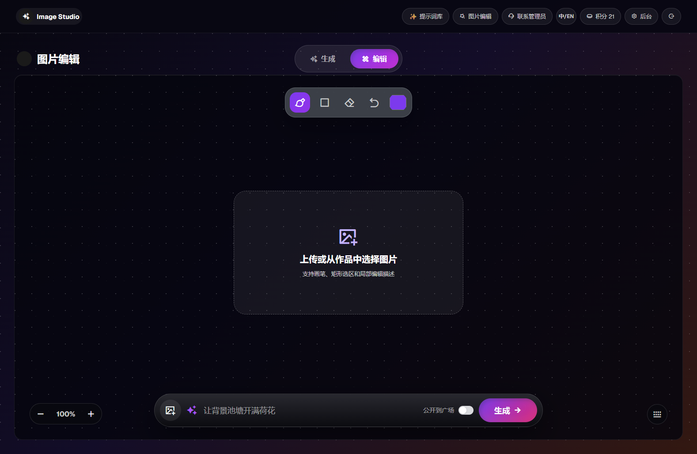

# GPT Image Studio

一个可自托管的 AI 图片生成站点，包含前台创作、提示词库、图片编辑、用户登录注册、积分系统、每日签到、公开广场和管理员后台。项目使用 Node.js 原生 HTTP 服务、MySQL 和静态前端实现，适合个人部署、二次开发或作为图片生成产品原型。

> 本项目不内置任何 API Key 或默认代理地址。部署后请在管理员后台或 `.env` 中填写你自己的 AI API 地址和密钥。

## Features

- GPT Image 风格的图片生成前台
- 用户注册、登录、退出和会话管理
- 每日签到获得积分，生成图片按积分扣费
- 管理员后台可配置 API 地址、API Key、模型和积分规则
- 管理员可查看生图审计记录，包括提示词、用户、IP、浏览器信息和错误信息
- 用户可查看自己的最近生成记录
- 支持公开到广场，首页展示用户允许公开的作品
- 内置提示词库，可搜索、复制、直接填入生成框
- 支持参考图上传预览、图片编辑、矩形/画笔标注区域后重新生成
- 支持常用比例、2K、4K 和自定义尺寸
- MySQL 持久化用户、设置、积分、生成记录和审计日志
  ##图片预览




## Tech Stack

- Node.js 22+
- MySQL 8+
- Vanilla HTML/CSS/JavaScript
- 原生 `fetch` 调用兼容 OpenAI Images API 风格的服务

## Quick Start

```bash
npm install
copy .env.example .env
node server.js
```

默认启动地址：

```text
http://localhost:3000
```

管理员后台：

```text
http://localhost:3000/admin
```

## Environment Variables

复制 `.env.example` 后按需修改：

```env
PORT=3000

MYSQL_HOST=127.0.0.1
MYSQL_PORT=3306
MYSQL_USER=root
MYSQL_PASSWORD=change-me
MYSQL_DATABASE=gpt_image_studio
MYSQL_CONNECTION_LIMIT=10
MYSQL_CREATE_DATABASE=true

ADMIN_EMAIL=admin@example.com
ADMIN_PASSWORD=change-this-password
ADMIN_NAME=Admin

AI_API_BASE_URL=
AI_API_KEY=
IMAGE_MODEL=GPT-IMAGE-2

DEFAULT_CREDITS=10
GENERATION_CREDIT_COST=1
CHECKIN_CREDIT=1
ALLOW_REGISTRATION=true
REQUIRE_APPROVAL=false
MAX_IMAGES_PER_REQUEST=1
```

说明：

- `AI_API_BASE_URL`：你的 AI API 服务地址，例如兼容 OpenAI Images API 的网关地址。
- `AI_API_KEY`：你的 API 密钥。密钥只保存在服务端环境变量或数据库设置里，不会下发到浏览器。
- `ADMIN_EMAIL` / `ADMIN_PASSWORD`：首次启动时用于自动创建或激活管理员账号。
- `GENERATION_CREDIT_COST`：每次生成消耗的积分。
- `CHECKIN_CREDIT`：用户每日签到获得的积分。

## Database

应用启动时会自动创建数据库和表：

```env
MYSQL_CREATE_DATABASE=true
```

也可以手动导入：

```bash
mysql -u root -p < database/schema.sql
```

## Admin Setup

1. 设置 `.env` 里的管理员邮箱和密码。
2. 启动服务并访问 `/admin`。
3. 在「接口设置」里填写 API 地址、API Key、模型、注册送积分、生成扣费积分等配置。
4. 在「用户管理」里启用/禁用用户、调整积分。
5. 在「生图记录」里查看提示词、IP、浏览器和错误信息，便于内容安全排查。

## API Compatibility

图片生成默认请求：

```text
POST {AI_API_BASE_URL}/v1/images/generations
```

图片编辑默认请求：

```text
POST {AI_API_BASE_URL}/v1/images/edits
```

如果你的 `AI_API_BASE_URL` 已经包含 `/v1` 或完整 endpoint，服务端会自动拼接或复用对应路径。

## Development

运行基础语法检查：

```bash
node --check server.js
node --check public/app.js
node --check public/admin.js
```

运行 smoke test：

```bash
set RUN_MYSQL_SMOKE=1
set MYSQL_DATABASE=gpt_image_studio_test
node scripts/smoke-test.js
```

## Security Notes

- 不要把 `.env`、数据库备份、上传文件、生成图片目录提交到 GitHub。
- 不要在 README、截图、Issue 或 Commit 里暴露 API Key、数据库密码、服务器 IP 和 SSH 密码。
- 建议生产环境开启 HTTPS，并把生成图片迁移到对象存储或 CDN。
- 管理员后台应使用强密码，必要时放在反向代理鉴权或内网访问后面。
- API Key 支持在后台配置，但仍建议只给可信管理员开放后台。

## Project Structure

```text
.
├── database/           # MySQL schema
├── public/             # Frontend assets
├── scripts/            # Local helper scripts and smoke tests
├── src/                # MySQL store and shared server helpers
├── server.js           # HTTP server and API routes
├── .env.example        # Safe environment template
└── README.md
```
# 鸣谢：[linuxdo](https://linux.do/)
## License

MIT
